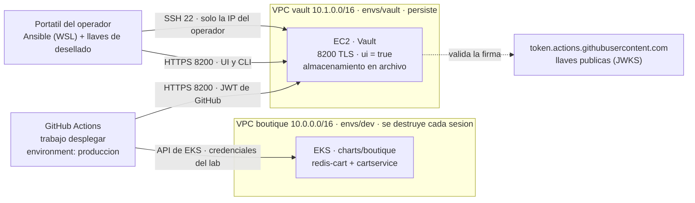
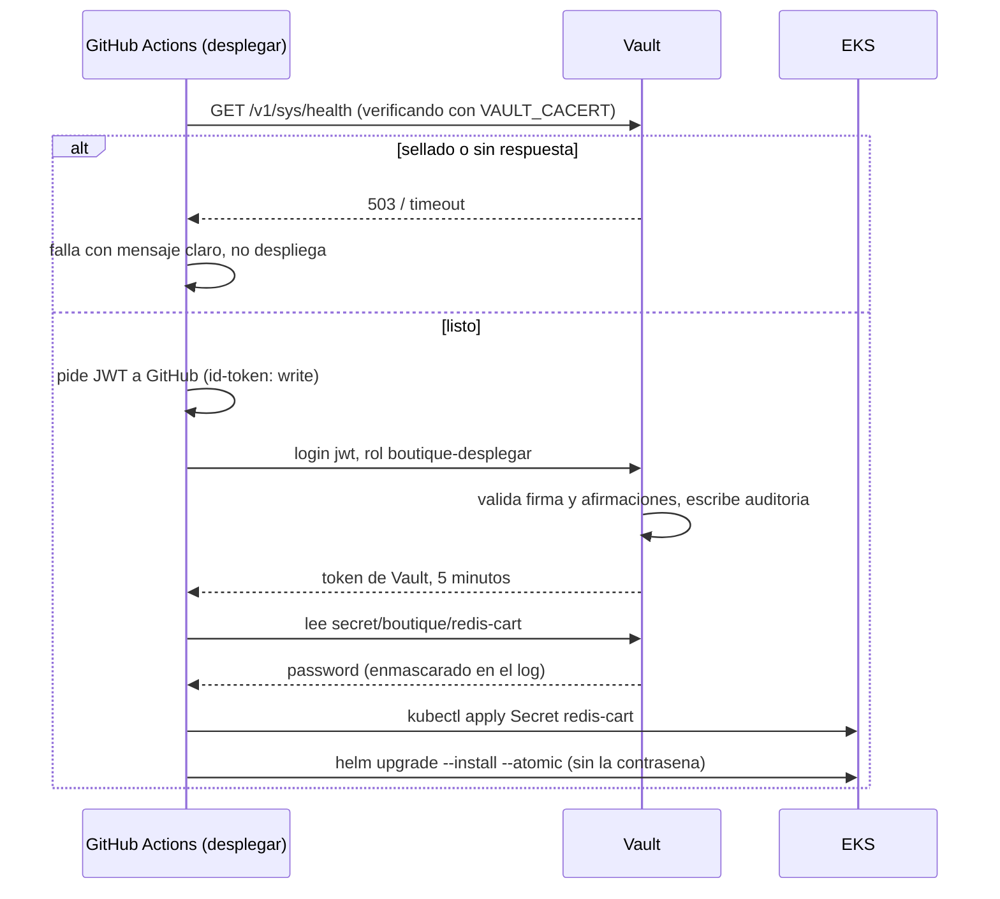

# 0019 · Los secretos salen de Vault, y el pipeline entra con su propio token

- **Estado:** aceptada; **reemplazada en parte por la 0020** (grupo de
  seguridad, entrada del pipeline, entrega al pod, custodia de las llaves y
  rotacion). Leer las dos juntas.
- **Issues:** #97
- **Cubre:** Pasos 3 y 4 de la Fase III (flujo de secretos y topologia)

## Contexto
Hasta la v2.2.0 el proyecto no gestiona secretos: no los tiene. Los dos Redis
corren sin contrasena, y lo unico sensible que existe son las credenciales del
laboratorio de AWS, copiadas a los secretos de GitHub por
`scripts/aws/sincronizar-credenciales.sh`.

La Fase III pide HashiCorp Vault como **unica fuente de verdad** de los secretos,
instalado por Ansible en una maquina fuera del cluster, y un pipeline que los lea
de ahi en tiempo de despliegue. Antes de crear nada queda escrito que secreto
migra, donde vive Vault, como entra el pipeline y que se acepta como limitacion.

Tres restricciones del laboratorio condicionan todo lo demas:

- **No se pueden crear roles de IAM** (ADR 0015). Descarta el auto-unseal con KMS
  y el motor de secretos de AWS.
- **`apagar.sh` destruye `envs/dev` cada sesion.** Lo que viva ahi se pierde.
- **Al cerrar el laboratorio las instancias EC2 se detienen.** No se destruyen,
  pero se apagan.

## Inventario: que hay y a donde va

| Valor | Hoy | Decision |
|---|---|---|
| Contrasena de `redis-cart` | no existe: Redis sin `requirepass` | **se crea y vive en Vault**. Es el secreto de la fase |
| Contrasena de `redis-wishlist` | no existe | fuera de alcance: el cliente de `wishlistservice` es propio y no implementa `AUTH` |
| Credenciales del laboratorio de AWS | secretos de GitHub, se renuevan cada sesion | **se quedan donde estan**. Vault solo podria emitirlas con el motor de AWS, que necesita crear usuarios o roles de IAM |
| `GITHUB_TOKEN` | lo genera GitHub por ejecucion | sin cambio: ya es efimero |
| Nombre del bucket del estado | `backend.hcl`, fuera de Git | no es secreto, es configuracion (ADR 0013) |
| Token raiz y llaves de desellado de Vault | — | **nunca** en Git ni en GitHub. Ver mas abajo |

Por que la contrasena de Redis y no otra cosa: es un secreto genuino, con un
consumidor real y un fallo visible. Si llega mal, el carrito deja de funcionar.
Eso hace que la evidencia demuestre algo.

El consumidor no necesita cambios de codigo. `cartservice` (la imagen de Google,
`v0.10.6`) pasa `REDIS_ADDR` tal cual a StackExchange.Redis, que acepta una
cadena de conexion completa:

```yaml
env:
  - name: REDIS_PASSWORD
    valueFrom: { secretKeyRef: { name: redis-cart, key: password } }
  - name: REDIS_ADDR
    value: "redis-cart:6379,password=$(REDIS_PASSWORD)"
```

Y Redis arranca con `args: ["--requirepass", "$(REDIS_PASSWORD)"]` leyendo el
mismo Secret. Las sondas son TCP, asi que no necesitan la contrasena.

## Decision

### Topologia



- **Una EC2 propia, en su propio entorno de Terraform**, `infra/aws/envs/vault/`,
  con su propia clave de estado (`vault/terraform.tfstate`) en el mismo bucket.
  `apagar.sh` no la toca. Ubuntu 24.04 LTS, `t3.micro`: Vault con un secreto no
  necesita mas.
- **Su propia VPC, sin emparejar con la del cluster.** Los pods nunca hablan con
  Vault; quien habla con Vault es GitHub Actions, desde internet. Sin adyacencia
  de red no hay dependencia de estado entre los dos entornos, y se puede
  destruir uno sin tocar el otro. CIDR distinto (`10.1.0.0/16`) para que nadie
  confunda una con otra en la consola.
- **IP elastica.** Cuando el laboratorio se cierra la instancia se detiene; sin
  IP fija, la direccion cambiaria en cada sesion y con ella `VAULT_ADDR` y el
  certificado.
- **Terraform crea, Ansible configura.** Terraform: VPC, subred, grupo de
  seguridad, EC2, IP elastica. Ansible: todo lo que corre dentro. Nada a mano.

### Grupo de seguridad

| Puerto | Origen | Por que |
|---|---|---|
| 8200/tcp | `0.0.0.0/0` | GitHub Actions entra desde rangos de IP enormes que cambian con el tiempo. Lo que protege el puerto es TLS mas autenticacion, no la red |
| 22/tcp | la IP del operador (`/32`, variable de Terraform) | Ansible entra por SSH |

La lamina dice "exclusivamente el puerto 8200". El 22 es la excepcion
consciente: sin el, Ansible no puede configurar la maquina. Queda acotado a una
sola IP y se declara aqui en vez de esconderlo.

### Vault

Lo escribe el rol de Ansible en `vault.hcl`:

- `ui = true`, listener en `0.0.0.0:8200` con **TLS**. Vault por HTTP significa el
  token viajando en claro.
- **Certificado autofirmado**: Ansible genera una CA propia y con ella el
  certificado del servidor, con la IP elastica como SAN. El certificado de la CA
  es publico y se guarda como variable del repositorio (`VAULT_CACERT`), para que
  el pipeline **verifique** el servidor en vez de saltarse la verificacion.
- **Almacenamiento en archivo**, en el disco EBS de la instancia. Sobrevive a que
  el laboratorio detenga la maquina.
- **Sellado Shamir**: 3 fragmentos, 2 para desellar. Ninguna llave de AWS
  interviene.
- **Registro de auditoria** activado (`vault audit enable file`): cada lectura
  queda escrita con quien, que y cuando. Es lo que la lamina promete en
  "visibilidad y auditoria", y sin el no se puede demostrar.
- **Motor KV v2** en `secret/`. El secreto vive en `secret/boutique/redis-cart`,
  clave `password`.

### Como entra el pipeline: el token de GitHub, no AppRole

El trabajo `desplegar` pide a GitHub un JWT firmado (`permissions: id-token:
write`). Vault lo valida contra las llaves publicas de GitHub con su metodo
`jwt`, y solo si coinciden las afirmaciones del token emite un token de Vault:

```hcl
# auth/jwt/role/boutique-desplegar
role_type       = "jwt"
bound_audiences = ["vault"]   # vault-action: jwtGithubAudience: vault
user_claim      = "actor"
bound_claims = {
  repository  = "branToRep/microservices-demo"
  ref         = "refs/heads/main"
  environment = "produccion"
}
token_policies = ["boutique-lectura"]
token_ttl      = "5m"
token_max_ttl  = "10m"
```

```hcl
# politica boutique-lectura: solo lectura, solo esa ruta
path "secret/data/boutique/redis-cart" {
  capabilities = ["read"]
}
```

Consecuencias de la eleccion:

- **GitHub no guarda ninguna credencial de Vault.** `VAULT_ADDR` y
  `VAULT_CACERT` son variables, no secretos: no hay nada que robar.
- **Una rama o un PR no pueden leer el secreto**, aunque tengan acceso al
  repositorio: Vault rechaza el token porque `ref` o `environment` no coinciden.
- **Cada ejecucion recibe un token distinto que muere en minutos.** Es el "token
  unico" de la lamina, mas estricto que un token fijo.
- **La auditoria dice que commit y que persona** leyeron el secreto, no solo "el
  pipeline".

Lo que hace posible esto en el laboratorio: el bloqueo de OIDC del ADR 0015 es de
**IAM** (`iam:CreateOpenIDConnectProvider`). La validacion la hace Vault por su
cuenta y AWS no interviene. Lo unico que Vault necesita es salida HTTPS hacia
`token.actions.githubusercontent.com` para descargar las llaves publicas
(`oidc_discovery_url` del metodo `jwt`), y la subred publica ya la da.

### Del token al pod



- El valor llega a Kubernetes como un **Secret creado por el pipeline**
  (`kubectl create secret ... --dry-run=client -o yaml | kubectl apply -f -`),
  y el chart solo lo **referencia** por nombre. **No** se pasa con
  `helm --set`: Helm guardaria la contrasena en el registro de la release y
  saldria en `helm get values`.
- La comprobacion de vida va **antes** de pedir nada. El pipeline ya distingue
  "laboratorio cerrado" (sin credenciales de AWS: se salta con un aviso, como
  hoy). Si AWS responde pero Vault esta sellado o no contesta, eso **si** es un
  fallo y el trabajo sale en rojo con un mensaje que dice cual de los dos es.

### Las llaves y el token raiz

- **Llaves de desellado:** se generan una sola vez en `vault operator init`. No se
  guardan en el repositorio, ni en GitHub, ni en un archivo que lea un script.
  Cada operador guarda la suya fuera del repositorio, y `levantar.sh` las pide
  por teclado al empezar la sesion.
- **Token raiz:** solo para la configuracion inicial. Despues se **revoca**.
  Las personas entran a la UI con `userpass` y una politica propia. Si hace falta
  raiz otra vez, se regenera con `vault operator generate-root` y las llaves.

## Alternativas descartadas
- **AppRole.** Es lo mas documentado y `vault-action` lo trae de serie. Pero el
  `secret_id` tiene que vivir en los secretos de GitHub, y entonces cualquier
  flujo del repositorio, en cualquier rama, puede leer la contrasena. Es la
  columna del medio de la tabla de la lamina ("variables en CI/CD", riesgo de
  *secret sprawl*), solo que movida un paso. Queda como plan B si la validacion
  del JWT da problemas.
- **Un token fijo en los secretos de GitHub.** Lo mismo que AppRole, peor: no
  caduca.
- **Auto-unseal con AWS KMS.** Necesita un rol de IAM para la instancia. Imposible
  en el laboratorio.
- **Vault dentro del cluster.** `apagar.sh` lo borraria cada sesion junto con sus
  datos, habria que reinicializarlo cada dia y el pipeline dependeria del
  cluster para obtener los secretos del cluster.
- **Vault Agent Injector, Vault Secrets Operator o External Secrets Operator.**
  Resolverian la rotacion (ver abajo), pero exigen que los pods alcancen Vault y
  que Vault valide tokens contra la API de un cluster que se crea y se destruye
  cada sesion. Fuera de alcance por tiempo.
- **HCP Vault (el servicio gestionado).** Quita justo lo que la fase pide
  demostrar: instalarlo y configurarlo con Ansible.

## Consecuencias
- **Rotar exige redesplegar.** El secreto se lee en tiempo de despliegue. Cambiar
  el valor en Vault no propaga nada hasta el siguiente pipeline, que recrea el
  Secret y reinicia `redis-cart` y `cartservice`. La tabla de la lamina describe
  rotacion dinamica; este diseno no la hace, y lo que la haria es la fila de
  arriba.
- **El 8200 esta abierto a internet.** Protegido por TLS y autenticacion, no por
  la red. Fijar los rangos de GitHub funciona hasta que GitHub los cambia.
- **Un solo nodo, sin respaldo.** Si se pierde el disco, se pierde Vault: se
  reinicializa y se vuelve a escribir el secreto. Aceptable para un secreto que
  podemos regenerar.
- **Vault vuelve sellado en cada sesion.** No es un defecto: sellarse al
  reiniciar es lo correcto. `levantar.sh` gana un paso de desellado.
- **El clon limpio deja de ser transferible del todo.** La infraestructura se
  reproduce; los secretos no, por diseno. Quien clone levanta su propia Vault,
  que genera sus propias llaves. Hay que reescribir esa promesa en
  `docs/PRUEBA-CLON-LIMPIO.md`.
- **Ansible pide Linux.** En Windows corre desde WSL.
- **Las credenciales de AWS siguen en los secretos de GitHub.** Vault no las
  puede emitir en este laboratorio. Se declara, no se esconde.

## Como se va a comprobar
| Comprobacion | Evidencia |
|---|---|
| Ansible es idempotente | segunda corrida con `changed=0`, despues de destruir y recrear `envs/vault` |
| La UI es accesible y segura | captura en `https://<ip>:8200` con un usuario no raiz |
| La politica es de solo lectura | `vault policy read boutique-lectura` |
| El pipeline lee de Vault | log de `vault-action` y la linea del registro de auditoria con el SHA |
| Una rama no puede leer | el mismo flujo desde otra rama, rechazado por Vault |
| Vault sellado | el pipeline en rojo con mensaje claro, sin desplegar |
| Politica cambiada | se le quita `read`: el pipeline falla con `permission denied` |
| Contrasena incorrecta | captura del carrito roto, y vivo con la buena |
