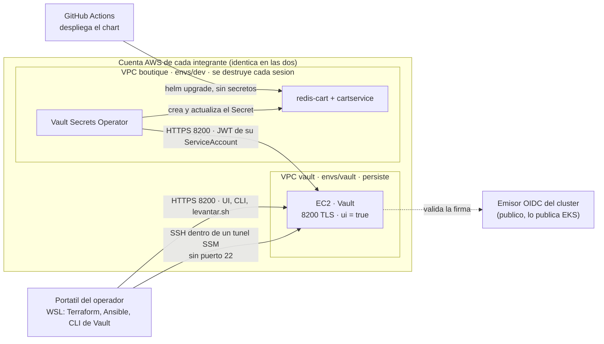

# 0020 · Una Vault por operador, entrada por SSM, y el cluster lee el secreto

- **Estado:** aceptada
- **Issues:** #99
- **Reemplaza en parte:** ADR 0019 (grupo de seguridad, entrada del pipeline,
  entrega al pod, custodia de las llaves y rotacion). El resto de la 0019 sigue
  en pie.

## Contexto
La 0019 se escribio antes de medir tres cosas, y las tres cambian el diseno.

**Cada integrante tiene su propia cuenta de AWS Academy.** Su bucket, su cluster
y sus instancias. Una Vault compartida viviria en la cuenta de uno solo, y al
cerrarse su laboratorio la instancia se detiene: el cluster del otro se quedaria
sin secreto hasta que el primero volviera a abrir sesion. Trabajamos en horarios
distintos (ver `docs/PROTECCION-RAMAS.md`), asi que eso pasaria a diario. Y la
materia existe para demostrar que el proyecto se destruye y se levanta en
cualquier cuenta, en cualquier momento, sin depender de nadie.

**SSH a una sola IP no sirve a dos operadores en redes que cambian.** La regla
`22/tcp` desde una `/32` habria que editarla cada sesion, y la lamina pide
abrir *exclusivamente* el 8200.

**Que el pipeline inyecte el secreto deja dos problemas.** Rotar exige
redesplegar (la propia 0019 lo declara), y el runner de GitHub tiene la
contrasena en memoria durante cada despliegue. La lamina describe otra cosa:
"Vault entrega el secreto dinamicamente en tiempo de ejecucion" y "actualizas
en Vault y las aplicaciones consumen la nueva version". Los Pasos 9 y 10, en
cambio, piden que lo haga el pipeline con `hashicorp/vault-action`.

Se consulto al profesor el 2026-10-06: se puede apartar de los Pasos 9 y 10 si
el cambio queda documentado y justificado. Este ADR es ese documento.

## Decision

### 1. Una Vault por operador

El mismo codigo de Terraform (`infra/aws/envs/vault/`) y de Ansible levanta una
Vault en la cuenta de **cada** integrante. Cada Vault confia solo en el cluster
de su misma cuenta y guarda su propia copia de la contrasena de Redis.



Lo que cuesta, y se declara:

- **Las llaves de desellado ya no se reparten entre personas.** Cada operador
  guarda los 3 fragmentos de su Vault en lugares separados (un gestor de
  contrasenas y una copia fuera de linea, por ejemplo). Shamir sigue protegiendo
  contra quien se lleve el disco o una instantanea, no contra el propio
  operador.
- **No hay una sola fuente de verdad para el equipo**, hay una por entorno. Es lo
  que se hace en la industria con un Vault por entorno (desarrollo, produccion);
  aqui el entorno es la cuenta.

### 2. Se entra a la maquina por SSM, no por SSH abierto

#### Resultado medido (2026-10-08)
En la cuenta de `branToRep`: instancia de prueba Ubuntu 24.04, `t3.micro`,
perfil de instancia `LabInstanceProfile`, grupo de seguridad **sin ninguna regla
de entrada**. La conexion por Session Manager abrio una terminal y `whoami`
devolvio `ssm-user`. La instancia se termino despues.

Queda por medir, en el ticket del entorno de Terraform:
- el documento `AWS-StartSSHSession`, que es el que usa Ansible y no el boton de
  la consola;
- la misma prueba en la cuenta del otro integrante.

#### Lo que cambia
- El grupo de seguridad tiene **una sola regla de entrada: 8200/tcp**. El 22 no
  se abre. Es lo que la lamina pide al pie de la letra.
- La EC2 lleva el perfil `LabInstanceProfile`, que ya existe en la cuenta: se
  referencia, no se crea (ADR 0015).
- Ansible sigue usando su conexion SSH normal, pero **dentro de un tunel SSM**.
  Se mantiene el comportamiento de siempre de Ansible y no hace falta un bucket
  de S3 como con el conector SSM nativo. Hace falta la AWS CLI y el
  `session-manager-plugin` en WSL, y un par de llaves para el SSH que viaja
  dentro del tunel. La llave privada nunca entra al repositorio.
- Quien puede entrar lo decide IAM (las credenciales de esa cuenta), no la red
  desde la que se conecta. Cada sesion queda registrada en AWS.

### 3. El cluster lee el secreto; el pipeline ya no toca Vault

Dentro de cada cluster corre el **Vault Secrets Operator** (VSO) de HashiCorp.
Se autentica en la Vault de su cuenta, lee `secret/boutique/redis-cart`, crea el
Secret `redis-cart` y lo mantiene al dia.

**Como se autentica, sin IAM y sin que Vault alcance el cluster.** Todo cluster
de EKS publica un emisor OIDC con sus llaves publicas, exista o no un proveedor
OIDC de IAM (lo que el laboratorio bloquea es crear ese proveedor, no el
emisor). Vault valida con su metodo `jwt` los tokens de una ServiceAccount
dedicada, igual que la 0019 pensaba validar los de GitHub:

```hcl
# auth/eks/config — se reescribe en cada sesion, ver "El precio"
oidc_discovery_url = "<emisor OIDC del cluster de esta sesion>"
bound_issuer       = "<el mismo>"

# auth/eks/role/boutique
role_type       = "jwt"
bound_audiences = ["vault"]
bound_subject   = "system:serviceaccount:default:lector-vault"
user_claim      = "sub"
token_policies  = ["boutique-lectura"]
token_ttl       = "10m"
```

La politica `boutique-lectura` de la 0019 no cambia: solo lectura, solo esa
ruta.

**Rotar ya no exige redesplegar.** El VSO vuelve a leer el secreto cada minuto.
Si cambia, actualiza el Secret y **reinicia por si mismo** `redis-cart` y
`cartservice` (`rolloutRestartTargets`). Esa es la razon de elegir el VSO y no
External Secrets Operator, que necesitaria otro componente para reiniciar.

```mermaid
sequenceDiagram
  participant L as levantar.sh (operador)
  participant V as Vault de su cuenta
  participant K as EKS
  participant S as VSO en el cluster

  L->>K: terraform apply (cluster nuevo, emisor OIDC nuevo)
  L->>V: desella si hace falta (llaves por teclado)
  L->>V: login userpass, escribe auth/eks/config con el emisor nuevo
  L->>K: instala el VSO (release propia) + VaultConnection + CA
  L->>K: helm upgrade --install boutique
  S->>V: login jwt con el token de lector-vault
  V->>V: valida firma, sujeto y audiencia, escribe auditoria
  V-->>S: token de Vault, 10 minutos
  S->>V: lee secret/boutique/redis-cart
  S->>K: crea el Secret redis-cart
  K->>K: redis-cart y cartservice arrancan con la contrasena
  Note over S,V: cada minuto vuelve a leer; si cambio, actualiza y reinicia
```

**Que queda en el chart y que no.** `charts/boutique` gana la ServiceAccount
`lector-vault`, el `VaultAuth` y el `VaultStaticSecret`, apagables por bandera.
El VSO **no** entra como subchart, aunque la 0018 lo dejaba abierto: es un
componente de plataforma con sus propios CRD y otro ciclo de vida, y un CRD
instalado dentro de la misma release que lo usa da problemas en las
actualizaciones. Lo instala `levantar.sh` como release aparte, con version fija.

La `VaultConnection` (direccion de la Vault y su CA) tampoco va en el chart:
cada operador tiene una direccion y una CA distintas. La crea `levantar.sh` con
lo que sale de `terraform output` en `envs/vault`, que esta en la misma cuenta.
Asi el pipeline sigue desplegando con el mismo comando de siempre, sin saber a
que Vault apunta el cluster.

**El pipeline.** No pide tokens, no lee secretos, no lleva `vault-action` ni
`id-token: write`. Sigue haciendo `helm upgrade --atomic` con el SHA del commit.

#### El precio
- **El emisor OIDC cambia en cada sesion**, porque el cluster se recrea.
  `levantar.sh` tiene que avisar a Vault antes de instalar la tienda. Si se
  salta ese paso, el VSO no se autentica y `redis-cart` no arranca: el fallo es
  visible, no silencioso.
- **Los nodos salen a internet para llegar a Vault.** Ya lo hacen: van en
  subredes publicas (ADR 0014). El 8200 sigue abierto a `0.0.0.0/0`, ahora
  porque las IP de los nodos cambian en cada sesion.
- **Rotar interrumpe el carrito unos segundos.** Los dos deployments se
  reinician a la vez, y los carritos se pierden (Redis sin volumen, a
  proposito, desde la v2.2.0).
- **Esta por medir** que Vault pueda descargar las llaves del emisor de EKS
  desde la instancia. Es HTTPS publico y deberia funcionar; se comprueba en el
  ticket que configura el metodo `jwt`, y se anota aqui.

## Lo que la 0019 sigue diciendo y no cambia
La EC2 en su propio entorno y su propia VPC, la IP elastica, TLS con CA propia,
almacenamiento en archivo, sellado Shamir 3/2, KV v2 en `secret/`, la ruta
`secret/boutique/redis-cart`, el registro de auditoria, la politica
`boutique-lectura`, el token raiz revocado tras configurar y el acceso de las
personas con `userpass`. Tambien el inventario de secretos y el consumidor de
Redis sin cambios de codigo.

## Alternativas descartadas
- **Una Vault compartida en la cuenta de uno.** Es la "unica fuente de verdad"
  literal, y ata el trabajo del otro a que el laboratorio del primero este
  abierto. Ademas haria falta un metodo `jwt` por cluster y un acceso cruzado
  entre cuentas.
- **SSH con la IP de cada operador.** Hay que editar el grupo de seguridad cada
  vez que cambia una red, y deja el 22 abierto.
- **El conector SSM nativo de Ansible.** Quita el par de llaves, pero exige un
  bucket de S3 para mover archivos y es mas lento y caprichoso con `become`.
- **Mantener `vault-action` en el pipeline (Pasos 9 y 10 al pie de la letra).**
  Cumple la lamina, y deja la rotacion atada al despliegue y la contrasena en el
  runner. Descartada con la aprobacion del profesor.
- **External Secrets Operator.** Neutral de proveedor y muy usado, pero no
  reinicia los pods al cambiar el secreto: habria que sumarle Reloader.
- **Vault Agent Injector.** Inyecta un contenedor auxiliar en cada pod; para un
  solo secreto en dos deployments es mas maquinaria que el VSO.
- **Metodo `kubernetes` de Vault en vez de `jwt`.** Exige que Vault llame a la
  API del cluster para revisar tokens, es decir, red entre las dos VPC. El `jwt`
  solo necesita las llaves publicas.

## Consecuencias
- **Se cumple la rotacion dinamica** que la tabla de la lamina promete y que la
  0019 declaraba imposible.
- **El secreto ya no pasa por GitHub.** Ni por sus logs ni por sus runners.
- **Si Vault se sella a media sesion, la tienda sigue funcionando** con el
  ultimo Secret sincronizado; lo que se detiene es la rotacion. En un arranque
  en frio, en cambio, sin Vault no hay tienda, y se ve.
- **`levantar.sh` crece**: desellar, avisar a Vault del emisor nuevo, instalar el
  VSO y la `VaultConnection`. Es el precio de no depender del pipeline.
- **El clon limpio se reproduce entero en otra cuenta.** Quien clona levanta su
  Vault, genera sus llaves y escribe su secreto. Ya no hay nada compartido que
  pedirle a nadie.

## Como se va a comprobar
Sustituye a la tabla de la 0019.

| Comprobacion | Evidencia |
|---|---|
| Ansible es idempotente | segunda corrida con `changed=0`, despues de destruir y recrear `envs/vault` |
| No hay puerto 22 | el grupo de seguridad con una sola regla, y Ansible entrando igual |
| La UI es accesible y segura | captura en `https://<ip>:8200` con un usuario no raiz |
| La politica es de solo lectura | `vault policy read boutique-lectura` |
| El cluster lee de Vault | el `VaultStaticSecret` sincronizado y la linea de auditoria con `lector-vault` |
| Rotacion sin redesplegar | se cambia el valor en Vault; en un minuto los pods se reinician y el carrito sigue vivo |
| Otra ServiceAccount no puede leer | un pod con otra cuenta de servicio, rechazado por Vault |
| Vault sellado | la tienda sigue; un arranque en frio falla con el motivo a la vista |
| Politica cambiada | se le quita `read`: el VSO registra `permission denied` y el Secret no cambia |
| Contrasena incorrecta | captura del carrito roto, y vivo con la buena |
